<h1 align="center">Nestor</h1>

<p align="center"><strong>Free nesting for less waste.</strong></p>

<p align="center">
An open-source nesting tool for <strong>laser, CNC and waterjet cutting</strong>.<br>
Import your DXF or SVG parts, choose your stock sheets, and let Nestor fit as much as possible onto as little material as possible.
</p>

<p align="center">
<a href="https://github.com/Glorfindel31/Nestor/releases/latest"><strong>⬇ Download the latest release</strong></a>
·
<a href="#build-from-source">Build from source</a>
·
<a href="https://ko-fi.com/glorfindel31">Support</a>
</p>

<p align="center">
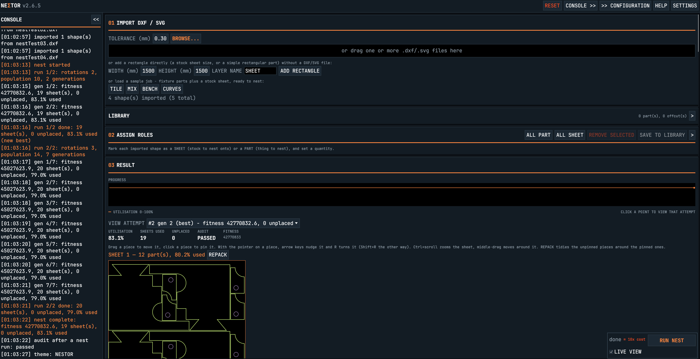
</p>

<p align="center"><em>450 parts, 19 sheets, 83.1% material used, audit passed — with a live log of every generation.</em></p>

**No subscription. No paywall. No limit on how much material you can save.**

---

## Download

No Rust, no build step, no installer — download one file and run it.

| Platform | File | Status |
|---|---|---|
| **Windows (x64)** | `Nestor_x64.exe` | Tested — this is the primary platform |
| macOS (Apple Silicon) | `Nestor_macos_arm64` | Best-effort CI build, unsigned |
| Linux (x64) | `Nestor_linux_x64` | Best-effort CI build, unsigned |

**→ [Get them from the latest release](https://github.com/Glorfindel31/Nestor/releases/latest)**

**Windows:** the executable is unsigned, so Windows SmartScreen will show *"Windows protected your PC"* the first time you run it. Click **More info → Run anyway**. Nothing is installed and nothing is written outside your own config folder.

**macOS:** unsigned, so you will need to allow it past Gatekeeper (right-click → Open, then confirm).

**Linux:** `chmod +x` the file before running it.

macOS and Linux builds compile and link in CI but have had little real-hardware testing. If you run Nestor on either, [opening an issue](https://github.com/Glorfindel31/Nestor/issues) — working or not — is genuinely useful.

---

## How good is it?

"Free" should not mean "good enough."

Nestor is benchmarked against a commercial nesting engine, and matches it on the six benchmark jobs currently in the test suite — including an 800-piece mixed-shape job.

You do not have to take that on trust. Reproduce it yourself:

```sh
sh bench.sh
```

> **Free software should not have to apologize for being free.**

---

## What is nesting?

When you cut parts from a sheet, you usually leave a lot of empty space behind. Nesting arranges those parts as tightly as possible, which means:

- less material purchased
- less material thrown away
- fewer sheets to cut
- lower production costs

Nestor automates that.

---

## How it works

Three numbered steps, top to bottom. There is no project to create, no wizard, no account.

### 01 — Import

Drop in `.dxf` or `.svg` files, type a rectangle straight in if your stock is just a sheet, or click one of the four sample jobs and nest something in the next five seconds without owning a single file.

<p align="center">
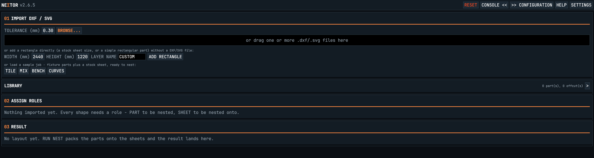
</p>

### 02 — Assign roles

Every shape is either a **SHEET** (stock to cut from) or a **PART** (a thing to cut). Set quantities, allowed rotation angles, and whether a part may be mirrored — per shape, or across everything you have selected.

<p align="center">
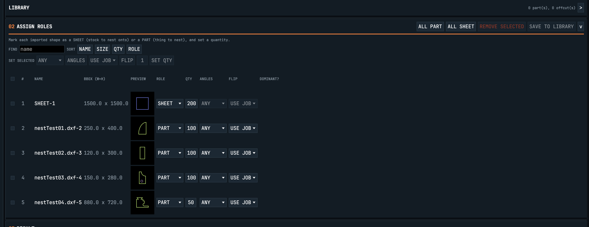
</p>

### 03 — Nest, review, export

Watch it improve generation by generation with **LIVE VIEW** on. When it settles, drag a piece to move it, pin it, nudge it with the arrow keys, rotate it with `R`, or **REPACK** a single sheet around the pieces you pinned. Then export to DXF or SVG — or print a full job report.

<p align="center">
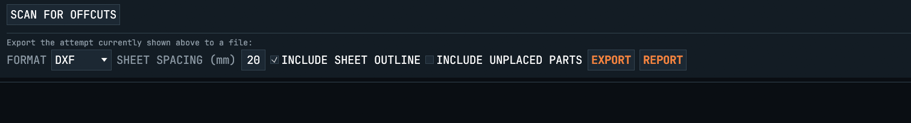
</p>

---

## What it can do

### Import & export
- DXF and SVG import, DXF and SVG export
- DXF layers preserved end to end (cut / etch / drill)
- Metric units, enforced rather than guessed
- Optional sheet outlines, configurable sheet spacing, and an option to include never-placed parts
- A printable job report — part list, sheet list with duplicate layouts collapsed, and remnant info

### Nesting
- Genetic-algorithm search with several placement strategies competing against each other
- Tight-fit placement for irregular shapes, gravity and box packing, convex-hull placement
- Shelf / band packing that detects when two parts interlock and steps the row by the real repeat distance, not the bounding box
- Part rotation and ordering optimisation
- Mirroring for non-symmetric parts (opt-in, per session)
- Live view of the search, and every attempt kept so you can go back to an earlier one

### Material management
- Multiple stock sheets
- Offcut / remnant tracking, with a scan that finds the usable rectangle left on a sheet
- A persistent parts library, so a part you cut often is one click away next time
- Automatic repacking of under-used sheets, and manual repack of any single sheet
- Independent edge clearance and part spacing — either one can be zero
- Kerf compensation

### Manufacturing safety
Every result is audited before export. Nestor checks for overlapping parts, parts outside the sheet, and insufficient clearances — and the final audit runs again against the actual geometry being exported, not against the plan that produced it.

### Nine languages
English, Tiếng Việt, Français, Español, Italiano, Deutsch, 日本語, 한국어, 中文 — the whole interface, not just the menus. Press `F1` for a one-screen explanation of the app in any of them.

<p align="center">
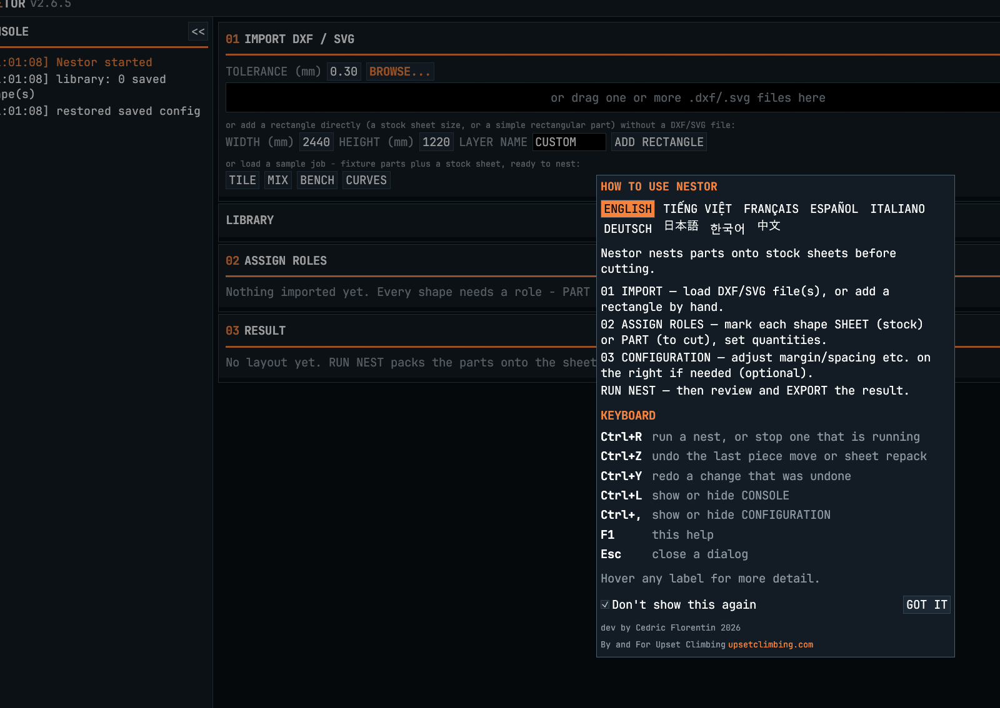
</p>

### Six themes
Because staring at a nesting tool all day is a real thing. Text size is adjustable too.

<table>
<tr>
<td width="33%">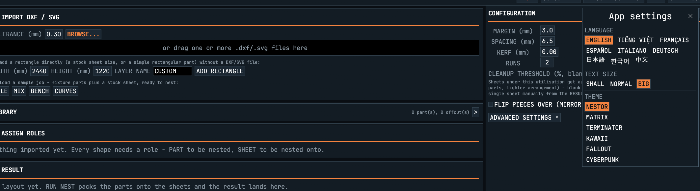<br><sub><b>NESTOR</b></sub></td>
<td width="33%">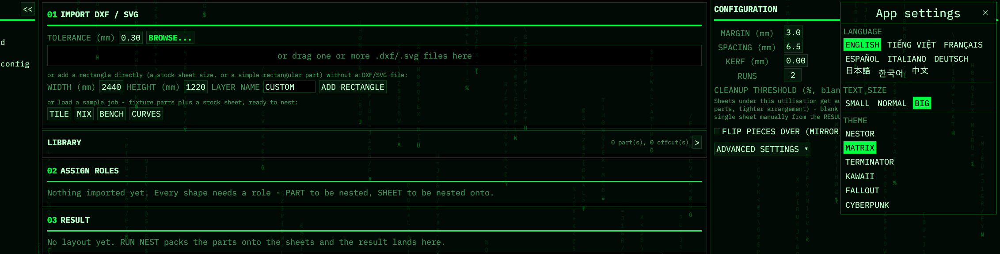<br><sub><b>MATRIX</b></sub></td>
<td width="33%">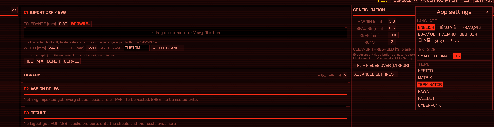<br><sub><b>TERMINATOR</b></sub></td>
</tr>
<tr>
<td>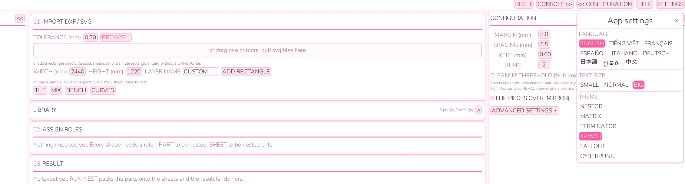<br><sub><b>KAWAII</b></sub></td>
<td>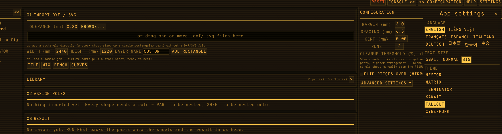<br><sub><b>FALLOUT</b></sub></td>
<td>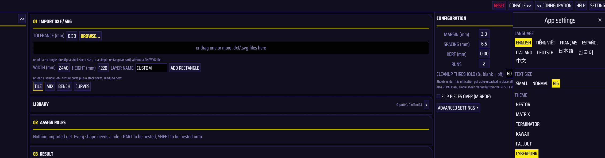<br><sub><b>CYBERPUNK</b></sub></td>
</tr>
</table>

---

## Why Nestor?

Nestor is a from-scratch Rust rewrite of [Deepnest](https://deepnest.net/). The goal was not another nesting application, but a **native, open-source nesting engine** that can be inspected, improved, reused and freely distributed.

The result is a single native binary.

No webview. No browser. No JavaScript runtime. No server. Just the geometry, the nesting engine and the application.

```
crates/
├── geometry/    geometry, NFP, DXF/SVG, boolean operations
├── nesting/     placement, genetic algorithm, packing
└── app/         native UI and application logic
```

The geometry and nesting engines are independent library crates, so they can be tested and reused without the UI. The application uses `egui` / `eframe`, with `rayon` for parallel computation.

---

## Build from source

Most people should just [download a binary](https://github.com/Glorfindel31/Nestor/releases/latest). To build it yourself you need a recent stable Rust toolchain ([rustup](https://rustup.rs/)):

```sh
git clone https://github.com/Glorfindel31/Nestor.git
cd Nestor

cargo build --release
cargo run --release -p rustynesting
```

Run the tests:

```sh
cargo test --workspace
```

The nesting engine also runs headless:

```sh
cargo run --release --bin nest -- \
    tests/fixtures/two.dxf \
    --qty 50 \
    --sheet 2440x1220 \
    --spacing 6 \
    --json
```

---

## Nesting should remain free

Almost everything can become a service, a subscription, or another small payment. Even tools whose entire purpose is to help us waste less can end up behind a paywall. This one shouldn't.

Nesting is useful to a factory producing thousands of parts. It is just as useful to someone with a CNC machine in their garage, a maker cutting plywood, a student learning fabrication, or someone trying to finish one project without throwing half a sheet in the bin.

> **If software can help you use less material, making that software freely available creates less waste.**

One person saving 10% of a sheet is not much. Thousands of people doing it across thousands of projects is a different number entirely. And if the tool costs nothing, there is no reason not to try it.

The scale changes. The principle doesn't.

**Material is finite. Waste is not inevitable. Efficiency should not be a luxury.**

---

## Open source means more than free

Nestor is released under the **MIT License** — use it, modify it, study it, build on it, ship it.

Found a bug, improved the algorithm, added a feature, or just have an idea? [Issues](https://github.com/Glorfindel31/Nestor/issues) and pull requests are welcome. This project belongs to everyone who wants to make better use of material.

---

## Support the project

Nestor is free and will stay free. Developing it still costs time.

**[Support Nestor on Ko-fi](https://ko-fi.com/glorfindel31)**

No feature is locked behind a donation. No material-saving capability is reserved for paying users.

---

<p align="center">
<strong>Nestor — free nesting, less waste.</strong><br>
<a href="https://github.com/Glorfindel31/Nestor">GitHub</a> ·
<a href="https://github.com/Glorfindel31/Nestor/releases/latest">Download</a> ·
<a href="LICENSE">MIT License</a> ·
<a href="https://ko-fi.com/glorfindel31">Support</a>
</p>